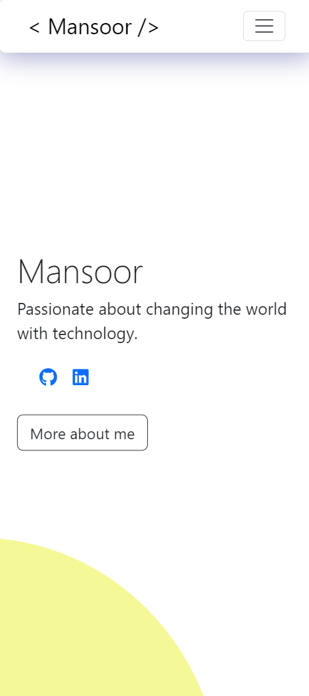
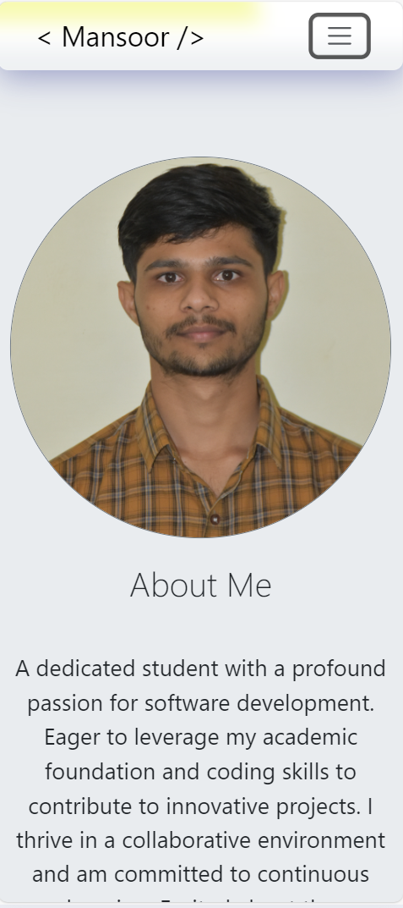
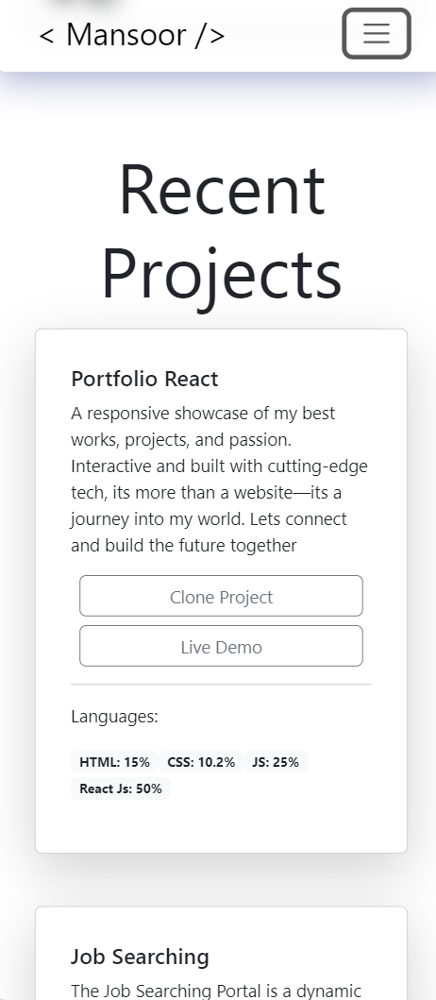
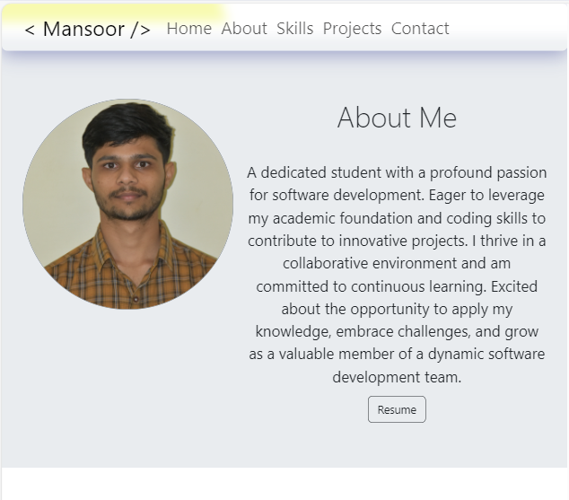
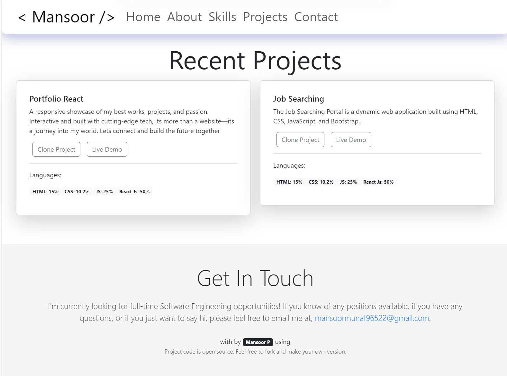
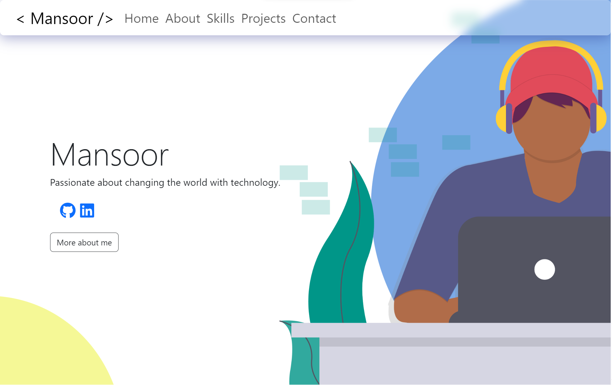
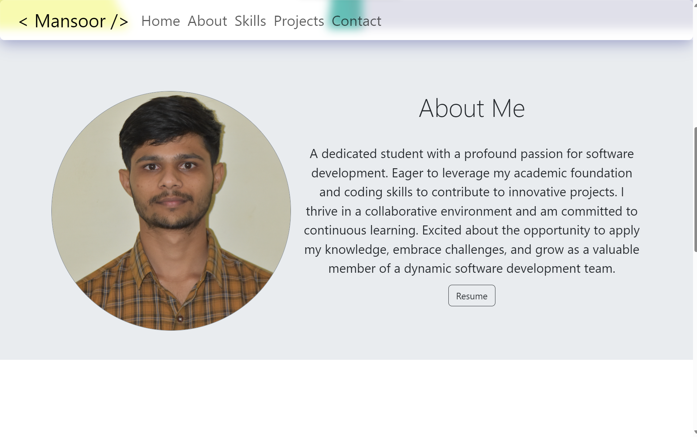

# My React Personal Portfolio

Welcome to my personal portfolio built with React! This project showcases my skills, projects, and provides an overview of who I am.

## Overview

This React personal portfolio is designed to highlight my accomplishments, skills, and projects. It is a dynamic and responsive web application that provides an easy-to-navigate experience for visitors.

## Demo

You can check out the live demo [here](https://mansoorsportfolio.netlify.app/).


## Features

- **Responsive Design:** Ensures a seamless experience across various devices.
- **Project Showcase:** Display and describe your projects with images and details.
- **Skills Section:** List your technical skills and expertise.
- **Contact Form:** Allow visitors to get in touch with you easily.

## Screenshots

### Mobile View

<div style="display: flex; justify-content: space-between;">
  
  
  
</div>

### Tablet View

<div style="display: flex; justify-content: space-between;">
  
  
</div>

### Laptop View

<div style="display: flex; justify-content: space-between;">
  
  
</div>


## Installation

1. Clone the repository:

   ```bash
   git clone https://github.com/Mansoor-P/responsive-portfolio-2?tab=readme-ov-file.git
   ```
