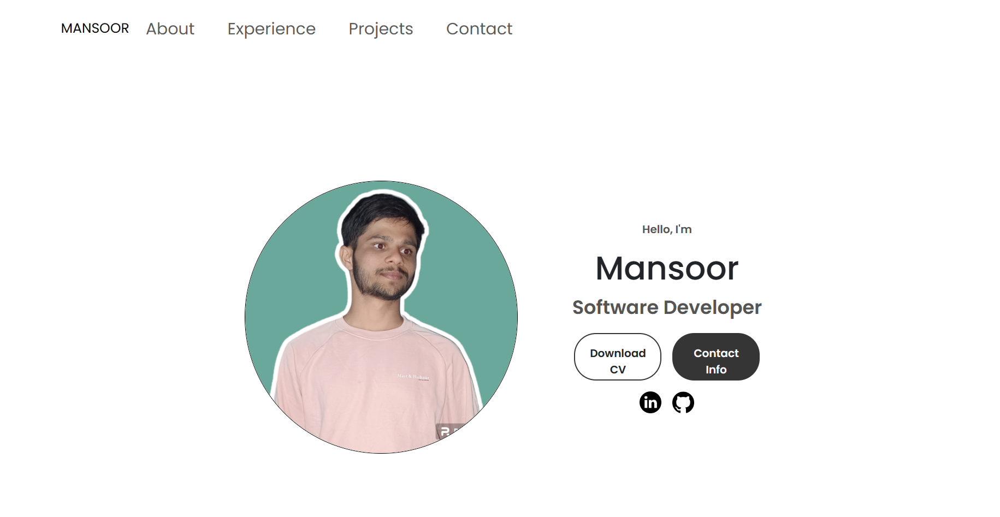

# Mansoor's Portfolio

<a href="https://www.example.com">
  
</a>

Welcome to my portfolio! I'm Mansoor, a passionate web developer. This portfolio showcases my skills, education, experience, and various projects that I've worked on.

## Overview

### ✨ Key Features
- **Responsive Design:** Ensures a seamless experience across various devices.
- **Project Showcase:** Highlights my best works and accomplishments.
- **Interactive Elements:** User-friendly interface with engaging components.
- **Tech Stack:** Developed using cutting-edge technologies and frameworks for optimal performance.


## Demo

🚀 Check out the live demo: [Your Portfolio Demo](your-demo-link)

🎥 Watch the walkthrough video: [Your Portfolio Video](your-video-link)


## Getting Started

1. **Clone the repository:**
    ```bash
    git clone https://github.com/your-username/your-portfolio.git
    ```

2. **Navigate to the project directory:**
    ```bash
    cd your-portfolio
    ```

3. **Open the website:**
    ```bash
    open index.html
    ```

## Contributions

Contributions and feedback are appreciated. Feel free to fork the project and submit pull requests.

## License

This project is licensed under MIT. See the [MIT - LICENSE](https://opensource.org/licenses/MIT) file for details.

## Connect with Me

- [LinkedIn](your-linkedin-profile)
- [Portfolio Website](your-portfolio-website-link)

## Inspiration

This portfolio is inspired by a fusion of design and functionality, reflecting my personality and passion for technology.

## Attributions

### Bootstrap

This project uses [Bootstrap](https://getbootstrap.com/) for styling. Bootstrap is licensed under the [MIT License](https://opensource.org/licenses/MIT). Make sure to check and comply with their license terms.


### Images

The images used in this project are sourced from [Unsplash](https://unsplash.com/). While Unsplash provides free-to-use images, it's essential to review and comply with their [license and usage terms](https://unsplash.com/license).


## Acknowledgments

Special thanks to the open-source community and contributors for their valuable insights and inspirations.

Let's Build the Future Together! 🚀
